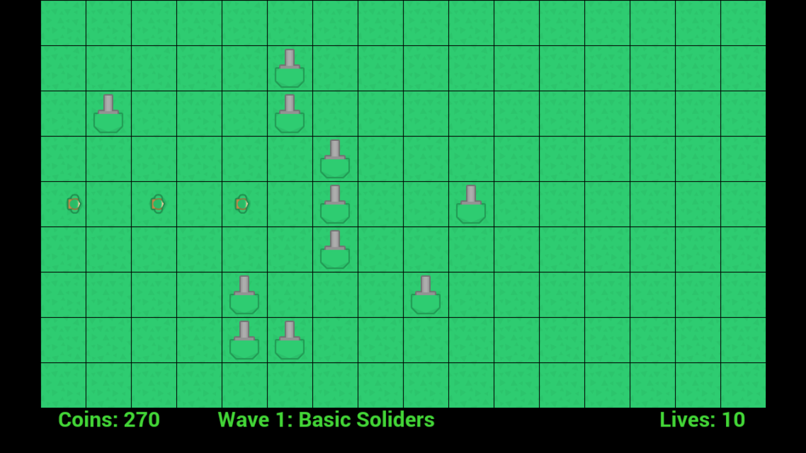

# Untitled Tower Defense Game



A prototype of a 2d tower defense game I threw together using:
* [Phaser.js](phaser.io)
* Some code extracted from [Pathfinding.js](https://github.com/qiao/PathFinding.js/)
* [Apache Cordova](https://cordova.apache.org/)
* [Crosswalk](https://crosswalk-project.org/)

The code is pretty crap and untested because I had very little time to write the
game and I needed a basic prototype as quickly as possible. Although it's only
a very rough prototype, the code at least gives the skeleton of a 2d tower
defense game and runs fairly smoothly on my Android phone (a Samsung Galaxy
S3 Neo). The assets are from the excellent (and creative commons)
[Kenney 2D tower defense asset pack](http://kenney.nl/assets/tower-defense-top-down).

The slightly complicated part was the path-finding which uses a breadth-first
search algorithm [as explained in this article](http://www.redblobgames.com/pathfinding/tower-defense/)
to find a path from every walkable square on the board to the exit. In doing so
it also allows a check to see if the grid is invalid e.g. if placing a tower
would result in there being no path from the entrance to the exit.

## Current status

The game runs in the browser (I only tested on Chrome) and on android devices.

#### What works

* Path-finding - creeps navigate the maze and you can't build a tower where it would block all possible paths
* Spawning multiple types of creeps - [configured here](js/constants/CreepTypes.js)
* Waves of creeps run in sequence - [configured here](js/constants/Waves.js)
* Lives - for every creep that reaches the exit you lose a life
* Coins - building towers costs money, killing creeps gets you money
* Towers firing bullets - towers pick the nearest target within range and attack it

#### What doesn't work

* You can crash the game by building on top of a moving creep
* Building in front of creeps sometimes makes them take freaky paths - path-finding maybe needs examining/improving
* When you run out of lives an error is thrown - no status screen or end-game card

#### Possible next steps

* Selecting or upgrading towers - No way to make towers better as creeps improve in later waves
* Multiple types of towers - Just bullet towers doesn't allow for tactical approaches
* Build times - Towers currently build instantly instead of having a delay
* Animation - towers are static and creeps just move in a linear way


## Development

### Requirements

* [Apache Cordova](https://cordova.apache.org/) - see also [their guide for an Android dev setup](https://cordova.apache.org/docs/en/latest/guide/platforms/android/index.html)
* [Yarn](https://yarnpkg.com/) or [NPM](https://www.npmjs.com/)
* [The Android SDK](https://developer.android.com/studio/index.html)

Install the npm packages with your chosen package manager before starting:

```
npm install

# or

yarn install
```

#### Running locally

```
npm run start
```

You can then see the game running at localhost:3000

#### Running in the Android emulator

First [set up an emulated device](https://developer.android.com/studio/run/managing-avds.html)
then run the command below. Beware that the Android emulator seems to be painful
or impossible to run on some machines. I used an Intel x86 image which seemed to
work ok but many people I spoke to just used their phone and Chrome remote debugging.
Good luck if you choose this route :P

```
npm run cordova-emulate
```

#### Running on the device

Plug your phone in, make sure it has remote debugging enabled and run the command
below which builds a debug version of the app, pushes it to the phone using adb
and runs it.

```
npm run cordova-device
```
